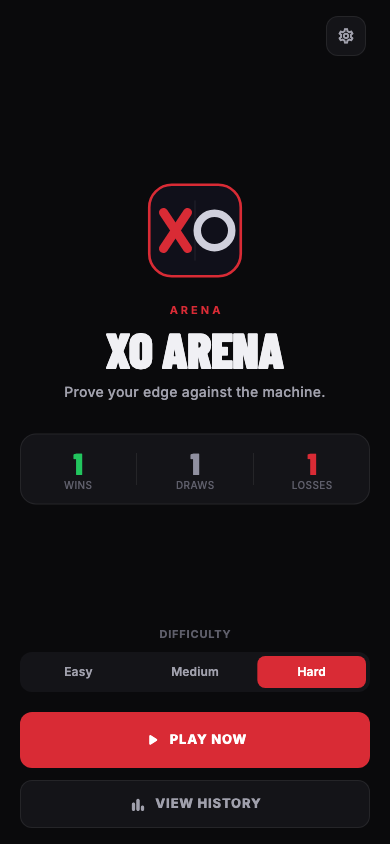
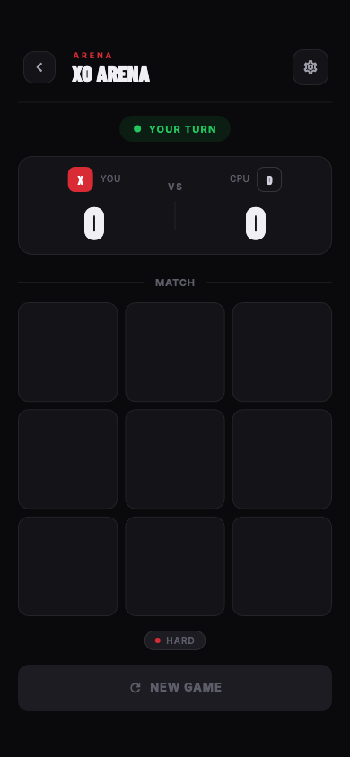
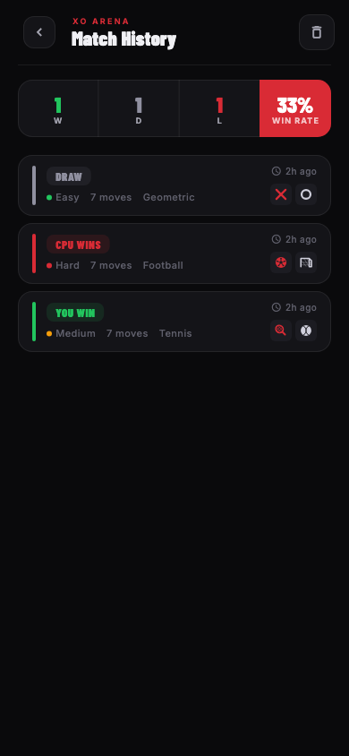

<div align="center">
  <a href="https://xo-arena-web-20260714.web.app">
    
  </a>

  <h1>XO Arena</h1>

  <p><strong>Prove your edge against the machine.</strong></p>

  <p>
    A polished Flutter tic tac toe experience built for Human versus CPU play.
  </p>

  <p>
    <a href="https://xo-arena-web-20260714.web.app"><strong>Play XO Arena on the web</strong></a>
  </p>

  <p>
    
    
    
    <a href="https://github.com/TheoAugust8/xo-arena/actions/workflows/quality.yml">
      
    </a>
  </p>
</div>

XO Arena favors clear domain rules, pragmatic Clean Architecture, deterministic behavior, accessibility, and tests over unnecessary feature breadth.

## Experience

<table>
  <tr>
    <td align="center">
      
    </td>
    <td align="center">
      
    </td>
    <td align="center">
      
    </td>
  </tr>
  <tr>
    <td align="center"><strong>Home</strong><br />Difficulty, statistics, and quick play</td>
    <td align="center"><strong>Game</strong><br />Responsive Human versus CPU match</td>
    <td align="center"><strong>History</strong><br />Persistent results and match details</td>
  </tr>
</table>

## Features

XO Arena includes:

* Responsive 3 by 3 board.
* Human versus CPU play.
* Easy, Medium, and Hard CPU levels. Hard uses Minimax with a controlled 10% chance of strategic imperfection.
* Explicit active game, win, and draw states.
* Restart support.
* Locked interaction while CPU is choosing a move.
* Accessible cell semantics and touch targets.
* Persisted completed game history.
* Persisted difficulty, symbol style, and theme preferences.
* Six vector symbol skins: Classic, Geometric, Tennis, Football, Poker, and Basketball.
* Responsive premium Home, Game, and History experiences.
* Short functional motion with reduced motion support.
* Synthesized gameplay sound cues with a persisted mute control.
* Branded native startup, animated launch sequence, and platform icons.
* Stable visual regression baselines for key screens and symbol skins.

## Prerequisites

Install:

* [Git](https://git-scm.com/)
* [FVM](https://fvm.app/), or Dart SDK for automatic FVM installation
* Flutter 3.44.0 through FVM
* Platform tooling for selected device, such as Android Studio with Android SDK or Xcode for Apple platforms

## Installation

```sh
git clone https://github.com/TheoAugust8/xo-arena.git
cd xo-arena
make install
```

`make install` checks for FVM. If unavailable, it requests confirmation before installing FVM 3.1.3 through Dart. It then reads `.fvmrc`, installs pinned Flutter SDK, fetches dependencies, and generates required Dart sources.

## Run application

Connect a device or start a simulator, then run:

```sh
make run
```

## Deploy web

Production runs on Firebase Hosting:

**[xo-arena-web-20260714.web.app](https://xo-arena-web-20260714.web.app)**

GitHub Actions builds every pull request to `main` and posts a Firebase preview
URL. A push to `main` deploys production.

Before first deployment, configure these GitHub repository values:

* `FIREBASE_PROJECT_ID` variable: `xo-arena-web-20260714`.
* `FIREBASE_SERVICE_ACCOUNT_XO_ARENA` secret: JSON key for a service account
  with Firebase Hosting Admin permission.

For a manual production deployment, install Firebase CLI, build web release,
then run:

```sh
firebase deploy --only hosting --project "$FIREBASE_PROJECT_ID"
```

`firebase.json` deploys `build/web` and rewrites unknown paths to
`index.html`, preserving direct links to application routes.

## Browse the design system

Run the interactive Widgetbook catalog on a connected device or in a browser:

```sh
make widgetbook
```

The catalog exposes semantic color tokens in light and dark modes, typography,
game cells, status badges, score, symbol skins, and settings variants.

## Development commands

```sh
make get              # Fetch Dart and Flutter dependencies through FVM
make run              # Run XO Arena
make widgetbook       # Run the interactive design system catalog
make sounds           # Regenerate bundled gameplay sound assets
make format           # Format Dart files
make format-check     # Check Dart formatting
make analyze          # Run static analysis
make test             # Run test suite
make coverage         # Enforce handwritten line and branch coverage
make integration-test DEVICE=macos # Run complete application flows
make goldens          # Run visual regression tests
make update-goldens   # Update inspected visual regression baselines
make generate         # Generate localization, Riverpod, Freezed, and JSON sources
make generate-watch   # Watch declarations and regenerate sources
make check            # Generate, check formatting, analyze, and test
make clean            # Clean Flutter outputs and restore dependencies
```

Run `make generate` after changing ARB translations, Riverpod annotations, Freezed models, or JSON serialization declarations. Generated localization, `*.g.dart`, and `*.freezed.dart` files are intentionally ignored by Git.

## Technical stack

| Area | Choice |
| --- | --- |
| Framework | Flutter 3.44.0 |
| Language | Dart 3.12.0 through Flutter |
| State management and DI | Riverpod 3 with code generation |
| Navigation | GoRouter |
| Immutable models | Freezed |
| Localization | Flutter gen_l10n with ARB sources |
| Local persistence | SharedPreferences |
| Sound playback | audioplayers |
| Tests | flutter_test and manual fakes |
| Code generation | build_runner, riverpod_generator, Freezed, json_serializable |
| Toolchain | FVM and Make |
| Continuous integration | GitHub Actions |

## Architecture

Project uses pragmatic Clean Architecture with feature first organization.

```text
Presentation -> Use cases -> Domain contracts <- Data
App composition -> Presentation + Domain + Data
```

Dependency rules:

* Domain stays independent from Flutter, Riverpod, GoRouter, and SharedPreferences.
* Repository contracts and business use cases live in Domain.
* Domain sources are grouped by responsibility into entities, repositories, services, and use cases where business rules require them.
* Presentation depends on domain concepts, useful use cases, and public providers.
* Data implements contracts owned by domain.
* Features do not import another feature. Shared boundaries carry cross feature concepts.
* Shared code exists only when several features genuinely depend on same concept.
* App composition is the only place that instantiates concrete data and audio dependencies.
* Abstractions belong at useful boundaries, not around every class.

Riverpod exposes presentation state and dependency ports. `app/di` supplies concrete repository and audio implementations at the application root without introducing framework dependencies into domain code.

## Folder structure

```text
lib/
  app/
    app.dart                   Application root
    di/                        Concrete dependency composition
    observers/                 Debug state observation
    router.dart                Home, Game, and History routes
  core/
    constants/                 Route, storage, and application constants
    design_system/             Tokens, themes, and reusable components
  features/
    home/
      presentation/            Home screen
    game/
      domain/
        entities/              Immutable Board and Game aggregate
        services/              Pure rules, CPU strategies, and audio port
        usecases/              Completed game persistence
      data/
        audio/                 Audioplayers implementation
      presentation/            Game screen
    history/
      presentation/            History screen and Riverpod composition
    launch/
      presentation/            Startup gate and animated launch screen
  shared/
    game_configuration/
      domain/entities/         Shared difficulty type
    game_records/
      domain/
        entities/              Records and statistics
        repositories/          Game record repository contract
      data/
        models/                JSON DTO and domain mapping
        datasources/           SharedPreferences access
        repositories/          Repository implementation
    game_symbols/
      domain/entities/         Shared symbol skin type
      presentation/            Shared symbol rendering
    settings/
      domain/
        entities/              Persisted application settings
        repositories/          Settings repository contract
      data/
        models/                Generated JSON DTO and domain mapping
        datasources/           SharedPreferences access
        repositories/          Settings repository implementation
      presentation/            Riverpod state and shared settings UI
  l10n/
    app_en.arb                 English application copy
    l10n.dart                  Localization access and exports
tool/
  generate_game_sounds.dart    Sound asset generation entry point
  game_sound_synthesizer.dart  Pure PCM WAV synthesizer
test/
  architecture/                Enforced dependency rules
  features/                    Feature domain, data, and widget tests
  goldens/                     Stable screen and symbol baselines
  shared/                      Shared domain, data, and presentation tests
```

`shared/game_records` is a small shared boundary. Game can write completed records, History reads and manages them, and neither feature depends on another feature's presentation code.

## State management

[Riverpod](https://riverpod.dev/) manages dependency composition plus Game, History, and Settings state.

`gameRecordsProvider` loads persisted records for Home statistics and History. After delete or clear operations, History invalidates provider so current local state is loaded again. Mutation controls remain disabled while an operation is pending.

`settingsProvider` exposes System theme, Hard difficulty, Classic skin, and enabled sound defaults immediately, restores stored choices asynchronously, and serializes writes. Home and Game share one settings state without importing `app` or each other's presentation code.

The game notifier owns turn orchestration, CPU waiting state, stale asynchronous result protection, completed game persistence, and restart behavior. The immutable `Game` aggregate owns the board, current player, player to symbol mapping, status, winner, and winning indexes. `Board`, win rules, and CPU algorithms stay pure and independent from Riverpod.

Debug builds register `AppStateObserver` at the root `ProviderScope`. It logs provider additions, updates, and failures while release builds pay no logging cost. The observer uses Riverpod's native observation boundary and accepts an injectable sink for focused tests.

## Persistence

`GameRecord` is a pure immutable Freezed domain model. `GameRecordDto` lives in Data and owns JSON conversion plus mapping to and from Domain. Records capture difficulty and symbol style snapshots while preserving the existing stored keys, enum names, and ISO 8601 dates.

`AppSettingsDto` applies the same generated JSON boundary to settings while `AppSettings` remains a storage independent domain value.

`GameRecordRepository` belongs to domain. `GameRecordRepositoryImpl` delegates to `GameRecordLocalDataSource`, while `SharedPreferencesGameRecordLocalDataSource` owns storage format and local mutations.

Local data source serializes write operations and makes reads wait for pending mutations. Concurrent save, delete, and clear calls cannot overwrite each other or expose a stale snapshot through overlapping read and write cycles. Invalid records are skipped individually, while a globally invalid payload returns an empty history. Failed writes remain visible as storage errors and do not block the next queued mutation.

## Navigation

[GoRouter](https://pub.dev/packages/go_router) defines three routes:

| Path | Screen | Role |
| --- | --- | --- |
| `/` | Home | Entry point and navigation |
| `/game` | Game | Human versus CPU game flow |
| `/history` | History | Stored game record management |

Three explicit destinations keep navigation simple while allowing each flow to evolve independently.

Route paths live in `AppRoutes`, keeping navigation calls and router declarations aligned without scattering string literals.

Routes use short fade and slide transitions. Flutter's reduced motion signal disables movement while preserving immediate navigation and state changes. Leaving Game disposes its auto dispose notifier, cancels pending CPU work, and ensures the next Game entry starts a fresh session.

## Sound design

Gameplay uses five short cues: Human placement, CPU placement, win, loss, and draw. Move cues use slightly longer envelopes to reduce the risk of being lost to mobile browser startup latency while staying unobtrusive. The project synthesizes its own PCM WAV files into bundled assets, so it carries no external audio samples or licensing burden. Asset playback avoids platform specific byte source behavior. Game domain owns the playback port, Game data implements it with audioplayers, and Game presentation maps state transitions to cues. Asset synthesis stays in `tool` and `make sounds` reproduces every bundled cue. Domain rules and controller orchestration remain independent from audio playback details.

Sound is enabled by default and can be muted from Settings. The choice persists with other game preferences. iOS playback uses the ambient audio category, respecting the Ring and Silent switch and mixing without interrupting other audio.

## Localization

User facing copy lives in ARB sources under `lib/l10n`. Flutter generates typed localization accessors consumed through `context.l10n`, so widgets do not own translation strings. English is the current supported locale. A new locale requires an additional ARB file and translated values, without changing presentation structure.

## Launch experience

The platform launch screens use the active light or dark brand background to avoid a white frame while Flutter initializes. Flutter then shows a compact rounded badge, sequential X and O drawing, title reveal, tagline, and progress indicator. Application content appears within two seconds. Reduced motion skips the sequence and exposes Home immediately. The same deterministic logo geometry produces the iOS, Android, macOS, and Web icons.

## Testing strategy

Current tests cover:

* Application startup and routes.
* Home navigation.
* Home statistics, shared settings, and premium actions.
* History loading, empty state, delete, clear, and mutation locking.
* History summaries, metadata, retry, and mutation failure feedback.
* History repository integration and reentrant mutation protection.
* GameRecord equality and copying plus GameRecordDto wire compatibility.
* Targeted record corruption, SharedPreferences write failures, serialization, and queue recovery.
* Completed game persistence use case.
* Preference defaults, generated JSON mapping, restoration, corruption fallback, no op updates, and ordered writes.
* Sound synthesis, minimum move cue duration, transition cue mapping, mute persistence, and Game integration.
* Sealed game evaluation variants and exhaustive result state compatibility.
* Debug state observation for provider additions and updates.
* Game record metadata validation and shared statistics.
* Launch timing, reduced motion behavior, and launch semantics.
* Architecture dependency rules between App, Core, Presentation, Domain, and Data.
* Six visual regression baselines covering Home, initial and completed Game, History, Settings, and every symbol skin.
* Complete application flows covering a persisted match and settings restoration.

Game coverage:

* Board shape, available moves, safe placement, and move count.
* All eight winning patterns.
* Draw and full board win distinction.
* Player alternation, player to symbol mapping, and wrong player rejection.
* Valid and invalid moves.
* No move after completion.
* Immediate CPU win and Human win block.
* Controlled Hard imperfection threshold, protected tactical moves, and a reachable Human win.
* Perfect Minimax fallback when imperfections are disabled.
* CPU never choosing occupied cell.
* Deterministic choice when scores tie.
* Interaction lock during CPU work.
* Restart while CPU result is pending.
* Board rendering, interaction lock, responsive layout, and reset behavior.

Pure domain tests form most of the game suite. Riverpod notifier tests use `ProviderContainer` overrides. Widget tests focus on visible behavior and user interaction.

Run full local quality gate with:

```sh
make check
```

`make coverage` excludes generated Dart and generated localization sources,
then requires at least 90% line coverage and 85% branch coverage. Run device
flows separately with `make integration-test DEVICE=macos`, replacing `macos`
with another configured Flutter device when needed. GitHub Actions runs these
flows on Linux under Xvfb.

## Technical decisions

### Why Riverpod

Riverpod combines reactive state management and dependency injection with typed providers and straightforward test overrides. It keeps composition explicit without requiring extra ceremony for project size.

### Why GoRouter

Home, Game, and History are distinct destinations. Declarative routes keep navigation visible, testable, and limited to actual product flows.

### Why repository around local persistence

SharedPreferences is an external implementation detail. Repository contract keeps domain independent from storage choice, while local data source isolates serialization and mutation ordering.

Settings use a domain repository because presentation must stay independent from SharedPreferences. `SettingsRepositoryImpl` delegates to a local data source, while `app/di` owns concrete construction.

### Why settings are shared

Home selects difficulty, Game consumes it, and History displays completed match snapshots. A small shared boundary gives all three features stable domain types and Riverpod composition without cross feature presentation imports.

### Why motion uses Flutter primitives

TweenAnimationBuilder, AnimatedSwitcher, route transitions, and modal overlays cover current motion needs. This keeps motion short, testable, dependency free, and compatible with reduced motion settings.

### Why Freezed is used for value state and unions

GameRecord and GameRecordStats benefit from generated equality and copying while JSON stays in the Data DTO. GameState uses generated value equality. `GameEvaluation` is a sealed Freezed union, making active, won, and draw results explicit and exhaustively matchable without impossible flag combinations. Board and Game stay explicit value types because their constructors enforce defensive collection copying, invariants, and controlled transitions. Simple types remain plain Dart when generation adds no clear value.

### Why Hard uses controlled Minimax imperfection

Minimax fits the 3 by 3 search space and can be tested without Flutter. Hard evaluates every valid move with depth aware scoring. On strategic turns where a lower scoring move exists, it has a 10% chance of choosing one. Immediate CPU wins and immediate Human threats remain protected. This keeps Hard strong while leaving a legitimate path to victory. Injected randomness and a configurable imperfection rate keep domain tests reproducible.

### Why no Flutter Hooks

Lifecycle needs do not justify extra dependency. Standard Flutter and Riverpod APIs remain sufficient.

## Contributing

Read [AGENTS.md](AGENTS.md) before changing code. Keep changes focused, preserve dependency rules, add tests for behavior, and run `make check` before handoff.
